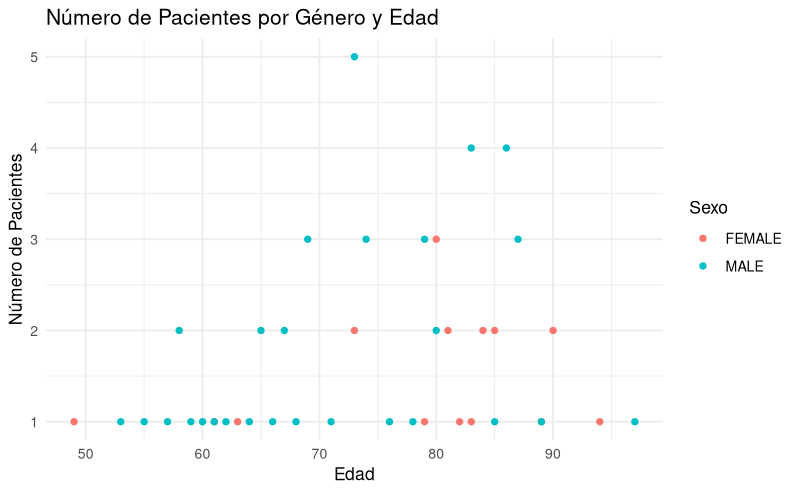
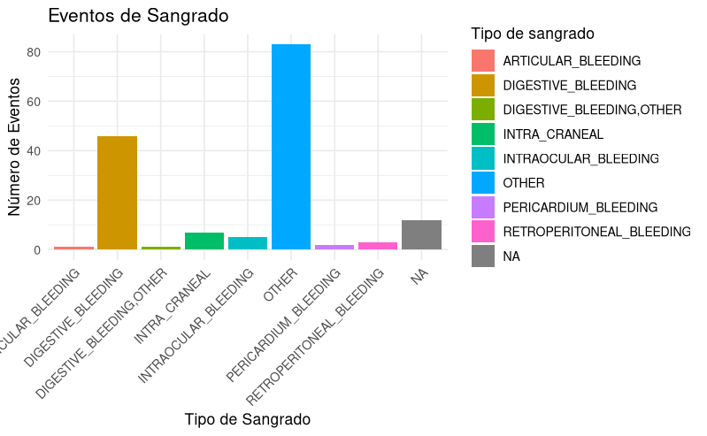
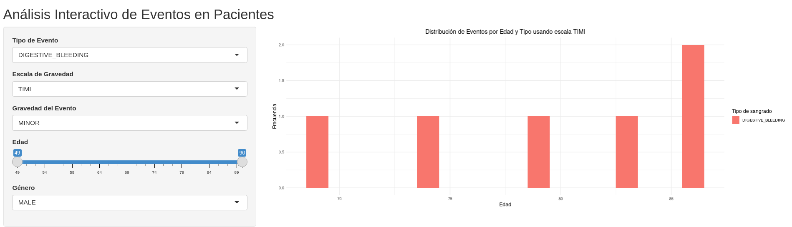
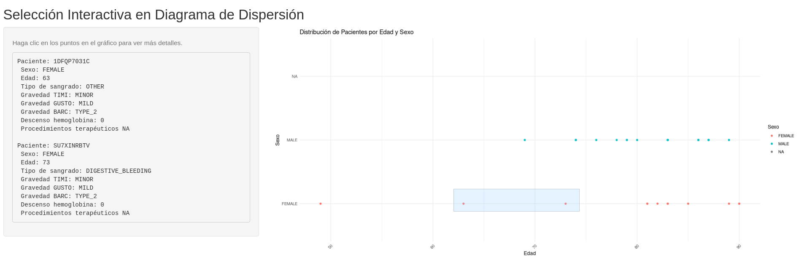

# Memoria del Proyecto de Visualización para la Unidad de Cardiología

## Problema

El proyecto tiene como objetivo desarrollar una herramienta de visualización gráfica para la unidad de cardiología de un hospital. Esta herramienta ayudará a monitorear a pacientes que han sido intervenidos mediante una intervención coronaria percutánea (ICP), permitiendo a los cardiólogos identificar los factores relacionados con eventos de sangrado y analizar la relación entre los eventos trombóticos y los de sangrado.

## Abstracción de Datos

### Datos de Pacientes (`datos_pacientes.xlsx`)

- **Edad**: Edad del paciente en años (numérico).
- **Paciente**: Identificador único del paciente (numérico o texto).
- **Sexo**: Género del paciente (categórico).

### Datos de Eventos (`datos_eventos.xlsx`)

- **Paciente**: Identificador único del paciente (numérico o texto).
- **Numero anticoagulantes**: Cantidad de anticoagulantes prescritos (numérico).
- **Numero antiagregantes**: Cantidad de antiagregantes prescritos (numérico).
- **Otro medicamentos**: Información sobre otros medicamentos administrados (texto).
- **Caracterización de la hemorragia**: Descripción del evento de hemorragia (texto).
- **Procedimientos terapéuticos**: Detalles de los procedimientos terapéuticos aplicados (texto).
- **Descenso de hemoglobina**: Cantidad de descenso en los niveles de hemoglobina (numérico).
- **Gravedad de la hemorragia (TIMI, GUSTO, BARC)**: Escalas de gravedad de la hemorragia (numérico).
- **Tipo de sangrado**: Clasificación del tipo de sangrado (categórico).
- **¿El paciente ha subido una trasfusión?**: Indica si el paciente recibió una transfusión (binario).

## Abstracción de Tareas

El usuario, en este caso un cardiólogo, necesita realizar tareas como:

1. Identificar los pacientes con mayor riesgo de sangrado.
2. Analizar la dependencia de los eventos de sangrado respecto a la terapia administrada y otros factores de riesgo.
3. Explorar la relación entre eventos trombóticos y de sangrado.

Para estas tareas, es crucial derivar atributos como el total de eventos por paciente, la severidad de los eventos, y la duración entre la intervención y cada evento.

## Implementación

El desarrollo del proyecto se realizó en RStudio, haciendo uso de librerías especializadas como `readxl` para leer los datos y `shiny` para las visualizaciones interactivas. 

### Visualizaciones generadas:

#### Visualización de la Cohorte de Pacientes por Género y Edad

- Se creó un diagrama de dispersión que muestra la distribución de pacientes por género y edad.
- Análisis: La gráfica indica que la mayoría de los pacientes masculinos se concentra en el rango de 60 a 80 años. Hay menos pacientes femeninos, y están más distribuidos a lo largo del rango de edades.

#### Visualización de Eventos de Sangrado

- Se elaboró un gráfico de barras para visualizar la cantidad de eventos de sangrado clasificados por tipo.
- Análisis: El tipo de sangrado más común es el 'OTHER', seguido por el 'DIGESTIVE_BLEEDING'. Esto podría indicar áreas donde la intervención médica y la monitorización deben ser más intensivas.

### Herramienta Exploratoria de Eventos

- **Descripción**: Esta herramienta permite visualizar eventos de sangrado, discriminados por gravedad, así como eventos trombóticos anteriores y posteriores a la hospitalización. Los usuarios pueden filtrar los datos por tipo de terapia, edad y género. Es necesario crear una nueva tabla que añada la edad a las tablas de eventos (trombóticos y de sangrado) para facilitar esta visualización.
- **Funcionalidad**: Los usuarios pueden seleccionar el tipo de evento, la escala de gravedad, la gravedad específica del evento, rango de edad y género, actualizando dinámicamente los gráficos en respuesta a los filtros aplicados.

### Selección Interactiva en Diagrama de Dispersión

- **Descripción**: Esta visualización permite a los usuarios interactuar directamente con un diagrama de dispersión de pacientes por edad y sexo. Los usuarios pueden clicar o seleccionar áreas en el gráfico para ver detalles específicos de los pacientes seleccionados.
- **Funcionalidad**: Al hacer clic o seleccionar puntos en el gráfico, se muestra información detallada del paciente, como el tipo de sangrado y la gravedad, entre otros datos relevantes. Esta funcionalidad ayuda a explorar de manera interactiva las características individuales de los pacientes dentro de la cohorte.

## Conclusiones

Las visualizaciones permiten una interpretación clara de la distribución de edad y género en la cohorte de pacientes, así como de los tipos de eventos de sangrado más frecuentes. Estos insights son esenciales para los cardiólogos al evaluar los riesgos asociados con diferentes grupos demográficos y al diseñar estrategias de tratamiento y seguimiento específicas.

## Futuras Mejoras

Para mejorar aún más la herramienta, se podrían considerar las siguientes adiciones:

- **Predicción de Riesgo**: Implementación de modelos predictivos que utilicen los datos históricos para estimar el riesgo de eventos de sangrado basándose en variables demográficas y clínicas.
- **Visualizaciones más Detalladas**: Desarrollo de visualizaciones que permitan explorar correlaciones específicas entre tipos de terapia y eventos de sangrado o trombóticos.

